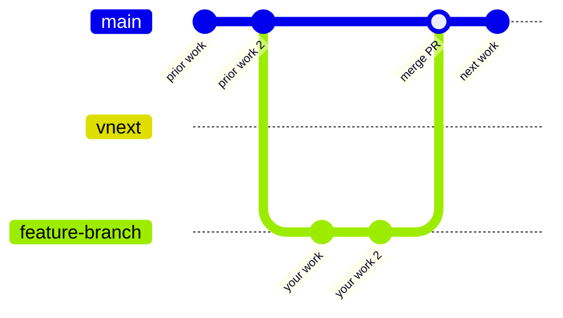
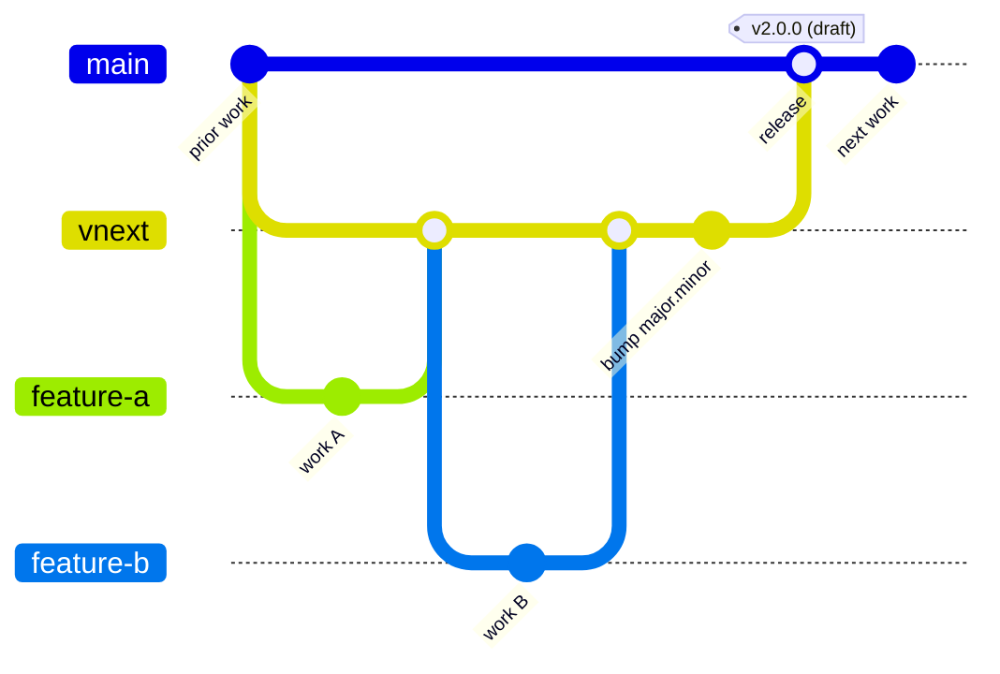

# Contributing to Overture Schema

Thank you for your interest in contributing.

## Branching Strategy

> **Work in progress.** This strategy is being rolled out incrementally. See the [DevOps tracking issue #490](https://github.com/OvertureMaps/schema/issues/490) for current status and upcoming phases.

This repository uses a two-branch model. Choose your target branch based on the nature of your change. See the [Change Classification](https://lf-overturemaps.atlassian.net/wiki/spaces/SCHEM/pages/14286874/Schema+versioning+and+stability#Change-Classification) wiki page for a detailed breakdown of what constitutes a minor vs. major change.

| Branch | Purpose |
|--------|---------|
| `main` | Default branch. Bug fixes, minor features, schema improvements. |
| `vnext` | Major or breaking changes tied to an active `vnext` milestone. |

When in doubt, target `main` and note in your PR description if you think it belongs in `vnext`.

### Normal contribution (`main`)



### Major / breaking change (`vnext`)



The `bump major.minor` commit edits the umbrella package's version in `pyproject.toml`. When the
release merge lands on `main`, CI cuts a draft GitHub Release at that version — see
[docs/versioning.md](docs/versioning.md).

## Branch Protections

Both `main` and `vnext` require a PR and at least two approving reviews before merge. No direct pushes.

## CI Checks

### PR target check (advisory)

Every PR runs an advisory label-vs-target check. It **never blocks** a merge — the reviewer is the
source of truth for change classification.

| Situation | Warning |
|-----------|---------|
| PR targets `vnext`, label is not `change type - major 🚨` | Consider targeting `main` instead |
| PR targets `main`, label is `change type - major 🚨` | Consider targeting `vnext` instead |

### vnext compatibility check

Every PR targeting `main` runs a compatibility check:

1. The PR is squash-simulated onto `main` in a throwaway clone.
2. `vnext` is dry-run rebased onto the result.
3. If there is no conflict — the check passes silently.
4. If there is a conflict — the check **fails** and CI posts a comment with exact commands.

**Skipped** for `vnext`→`main` release PRs.

#### Resolving a vnext conflict

If this check flags your PR, CI will post a comment listing the conflicting files. Do **not** rebase
your branch onto `vnext` — that would pull unreleased breaking changes into `main`.

1. See exactly what `vnext` changes in the conflicting files:
   ```bash
   git fetch origin
   git diff origin/main...origin/vnext -- <conflicting files>
   ```
2. Open each conflicting file in your editor. The diff above shows what `vnext` adds or changes
   there — adjust your edits so they no longer overlap with those lines.
3. Commit the adjustment and push:
   ```bash
   git add <conflicting files>
   git commit -m "fix: resolve vnext compatibility"
   git push origin your-branch
   ```

After pushing, the check re-runs automatically.

### Post-merge vnext rebase

When any PR merges to `main`, `vnext` is automatically force-rebased onto the new `main` HEAD
using the `overture-pull-requester` GitHub App.

**Skipped** for `vnext`→`main` release merges — `vnext` is already equal to `main` at that point.

If the automatic rebase fails, a GitHub issue is opened and assigned to the author of the merged PR.

> **Accepted tradeoff — in-flight PRs targeting `vnext`:** after the automatic rebase, the base of
> any open PR that targets `vnext` will be force-updated. If you have such a PR open, run
> `git pull --rebase` (or `git fetch origin && git rebase origin/vnext`) on your branch before
> pushing again.

### Version dry-run (informational)

After each push to `main` or `vnext`, CI runs the `compute-versions-dry-run` workflow. It logs what package versions **would** be stamped at publish time — no artifacts are actually produced. Check the workflow's job summary for a table of computed versions.

This workflow will be replaced by actual publish workflows in Phase 3.

### Release trigger

On every push to `main` that touches `packages/overture-schema/pyproject.toml`, the
`release-trigger` workflow compares the umbrella package's `<major>.<minor>` before and after.
On a bump it creates a **draft** GitHub Release tagged `v<major>.<minor>.0`; a maintainer then
writes the release notes and publishes the draft. Publishing the release is the **only** trigger
for a public PyPI publish (Phase 3). Patch-only changes are a no-op.

See [docs/versioning.md](docs/versioning.md) for the full version scheme, bump guidance, and
release process.

## Versioning quick reference

- `<major>.<minor>` is a human decision — edit it in `pyproject.toml` in your PR and reset patch
  to `0` (e.g. `1.17.1` → `1.18.0`). Minor bumps target `main`; major bumps target `vnext`.
- `<patch>` is computed by CI at publish time — never edit it manually.
- Only an `overture-schema` (umbrella) major/minor bump produces a public release. Other
  packages publish to CodeArtifact only and reach public PyPI by riding along an umbrella release.
- Details: [docs/versioning.md](docs/versioning.md).


## Migration Notes

> **Roadmap:** this branching strategy is rolled out in phases, tracked under the parent
> issue [#490](https://github.com/OvertureMaps/schema/issues/490). When Phases 0-4 are
> complete, this section can be removed in favor of more permanent documentation.

| Phase | Status | Delivers |
|-------|--------|----------|
| [0](https://github.com/OvertureMaps/schema/issues/506) | ✅ Done | Switch from `dev`/`staging` to the `main`/`vnext` model. |
| [1](https://github.com/OvertureMaps/schema/issues/507) | ✅ Done | CI guardrails: PR target check, vnext compatibility check, automatic post-merge rebase. |
| [2.A](https://github.com/OvertureMaps/schema/issues/508) | ✅ Done | Version baselines + `compute-version` action. Computes versions only — nothing is published yet. |
| [2.B](https://github.com/OvertureMaps/schema/issues/533) | ✅ Done | Detect an umbrella `<major>.<minor>` bump landing on `main` and cut the draft GitHub Release that gates a public publish. |
| [3](https://github.com/OvertureMaps/schema/issues/509) | ⏳ Planned | The actual publish workflows: `vnext` dev builds to CodeArtifact, `main` patch builds, and public PyPI releases. |
| [4](https://github.com/OvertureMaps/schema/issues/510) | ⏳ Planned | Documentation polish — diagrams, contributor walkthroughs, FAQ. |

### [Phase 0](https://github.com/OvertureMaps/schema/issues/506), May 2026

- `main` was fast-forwarded to the former `dev` HEAD.
- All open PRs were retargeted `dev` → `main` automatically.
- `dev` and `staging` branches were deleted.
- `vnext` was created from the new `main`.

If your fork still references `dev` or `staging`, update your remotes accordingly.

### [Phase 1](https://github.com/OvertureMaps/schema/issues/507), May 2026

- Advisory PR target check added: warns when your change-type label and target branch look mismatched.
- vnext compatibility check added: every PR to `main` verifies that `vnext` can rebase cleanly on top; posts exact fix commands on conflict.
- Post-merge automatic rebase added: `vnext` is force-rebased onto `main` after every merge; if it fails, a GitHub issue is opened.

### [Phase 2.A](https://github.com/OvertureMaps/schema/issues/508), May 2026

- All packages baselined with static versions in `pyproject.toml` (`overture-schema` at `1.17.1`, others at `0.1.1`).
- `compute-version` composite action added: computes PEP 440 versions for vnext (dev), main (patch), and main-bump (reset) contexts.
- `code-artifact` composite action added: replaces the legacy shell script for AWS CodeArtifact auth.
- `compute-versions-dry-run` workflow added for version visibility until Phase 3 publish workflows land.

### [Phase 2.B](https://github.com/OvertureMaps/schema/issues/533), July 2026

- `release-trigger` workflow added: detects an umbrella `overture-schema` major/minor bump on
  `main` and creates a draft GitHub Release at `v<major>.<minor>.0`. A maintainer writes notes
  and publishes — that `release: published` event is the only public PyPI trigger.
- Decisions locked: patch builds on `main` go to CodeArtifact only; release notes are authored
  manually at release time; only the umbrella package's bump cuts a release.
- `docs/versioning.md` added with the full version scheme and release process.

### [Phase 3](https://github.com/OvertureMaps/schema/issues/509)

Not started. Will add the actual publish workflows (`p3-dev-builds-ca`, `p3-main-publish`,
`p3-release-publish`) that call the `compute-version` action from Phase 2.A. Patch builds on
`main` publish to CodeArtifact only (decided in Phase 2.B); the public PyPI publish fires on
`release: published`.

### [Phase 4](https://github.com/OvertureMaps/schema/issues/510)

Not started. Final documentation pass: diagrams, contributor walkthroughs, and an FAQ. No
new procedures — this phase only makes the existing ones easier to read.
