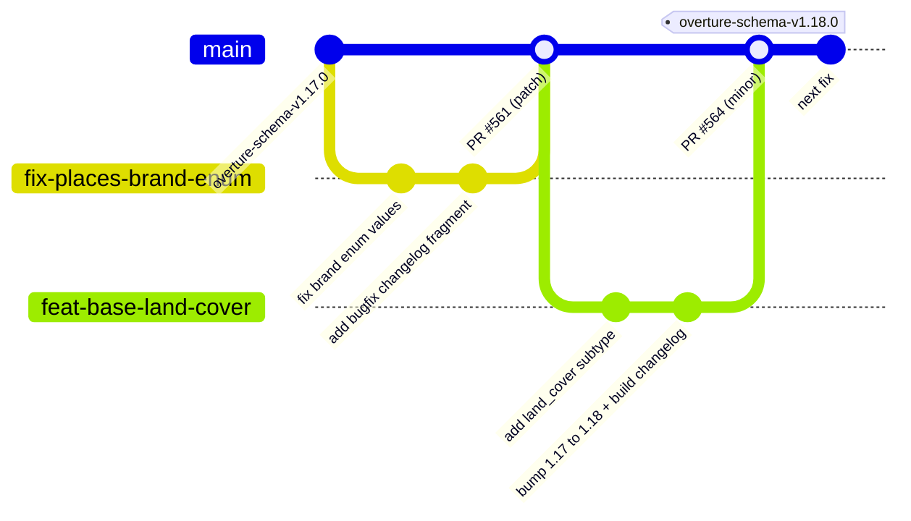
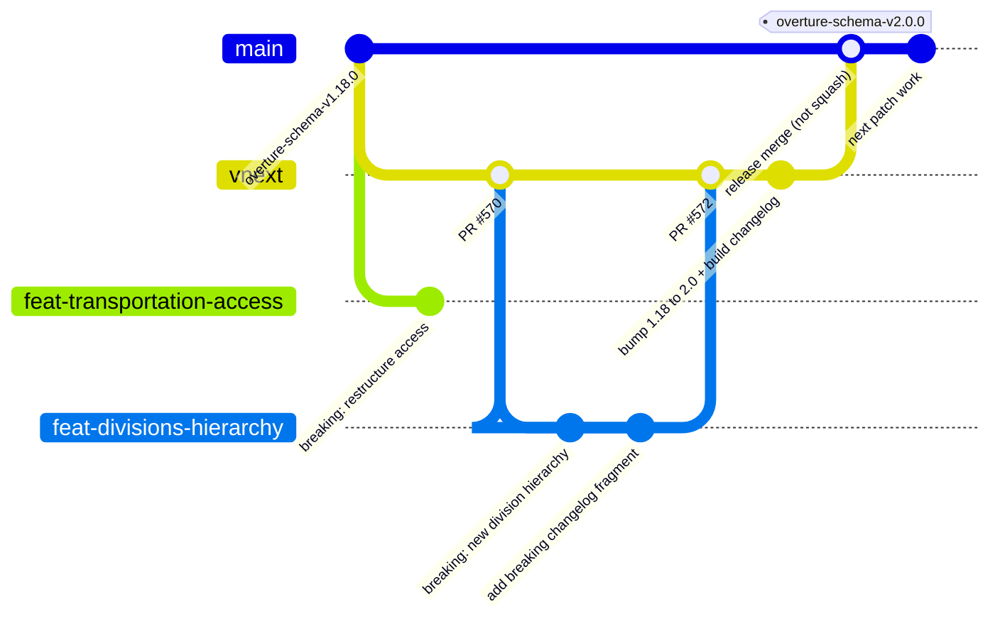

# Contributing to Overture Schema

Thank you for your interest in contributing.

> **The branching and versioning strategy is rolling out in phases.** See the
> [DevOps tracking issue #490](https://github.com/OvertureMaps/schema/issues/490)
> for current status and what is planned next.

## Where to send your change

This repository uses a two-branch model. Target the branch that matches your
change; when in doubt, target `main` and note in your PR if you think it belongs
in `vnext`. The
[Change Classification](https://lf-overturemaps.atlassian.net/wiki/spaces/SCHEM/pages/14286874/Schema+versioning+and+stability#Change-Classification)
wiki page breaks down what counts as a minor vs. major change.

| Branch | Use for |
|--------|---------|
| `main` | Default branch. Bug fixes, minor features, schema improvements. |
| `vnext` | Major or breaking changes tied to an active `vnext` milestone. |

### Normal contribution (`main`)

Everyday bug fixes and minor features branch off `main` and merge back through a
PR. Most merges ship as a CI-computed patch; a `major.minor` bump in the PR cuts
a release when it lands.

### Major / breaking change (`vnext`)

Breaking changes stack on `vnext` until the milestone is ready. Then `vnext`
merges into `main` as a regular merge (not a squash), which cuts the release.

The `bump ... + build changelog` commit edits the package version in
`pyproject.toml` and folds its `changelog.d/` fragments into `CHANGELOG.md`. When
the release merge lands on `main`, CI cuts a published GitHub Release tagged
`<package>-v<major>.<minor>.0` with those notes. See
[docs/versioning.md](docs/versioning.md).

## Opening a PR

- Both `main` and `vnext` require a PR and at least two approving reviews. No
  direct pushes.
- An advisory check nudges you if your change-type label and target branch look
  mismatched. It never blocks a merge; the reviewer is the source of truth.
- If your change would clash with upcoming `vnext` work, CI fails the PR and
  comments the exact commands to fix it. Do not rebase your branch onto `vnext`
  yourself; that pulls unreleased changes into `main`.
- If you have an open PR against `vnext`, its base may be force-updated after a
  merge to `main`. Run `git pull --rebase` before pushing again.

## Changing a package version

- `<major>.<minor>` is your call: edit it in `pyproject.toml` and reset patch to
  `0` (e.g. `1.17.1` becomes `1.18.0`). Minor bumps target `main`; major bumps
  target `vnext`.
- `<patch>` is computed by CI at publish time; never edit it manually.
- Every package versions and releases independently. Consumers pin only
  `overture-schema`, which pulls in the theme and support packages for a coherent
  set.
- A `major.minor` bump **requires a changelog fragment**. Add one under
  `packages/<package>/changelog.d/` and run
  `uvx towncrier build --config pyproject.toml --dir packages/<package>`. CI
  enforces it.

Full version scheme, tag scheme, and release flow: [docs/versioning.md](docs/versioning.md).
