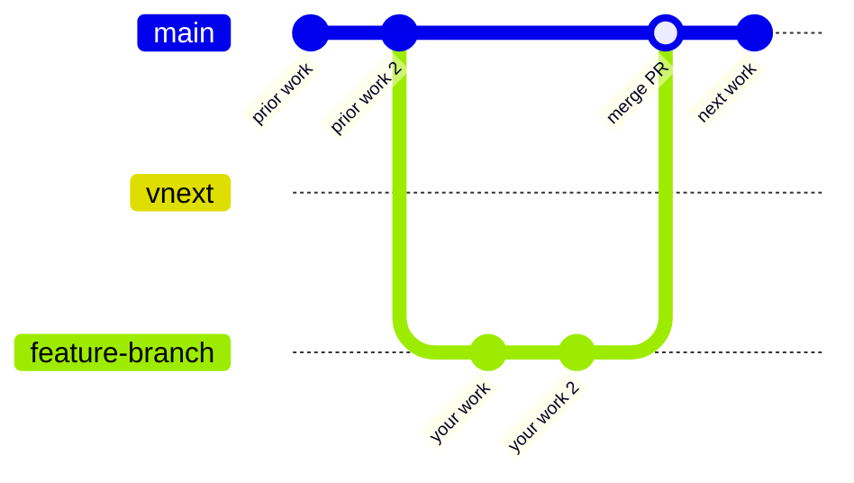
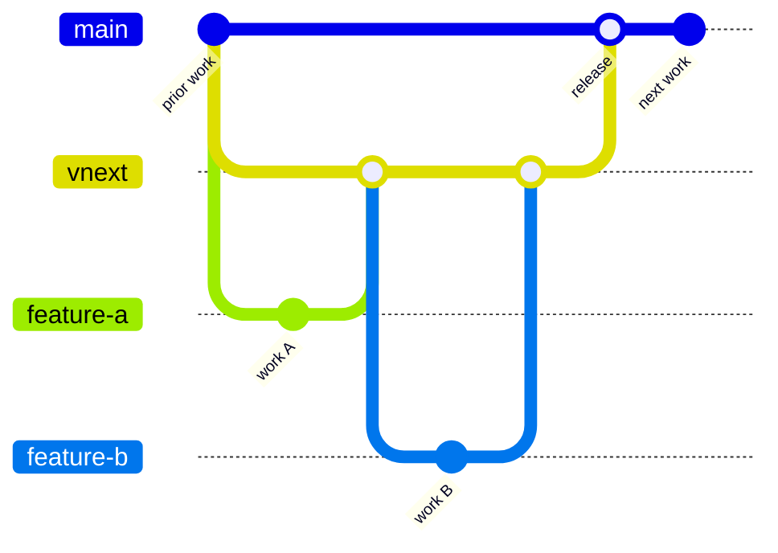

# Contributing to Overture Schema

Thank you for your interest in contributing.

## Branching Strategy

> **Work in progress.** This strategy is being rolled out incrementally. See the [DevOps tracking issue #490](https://github.com/OvertureMaps/schema/issues/490) for current status and upcoming phases.

This repository uses a two-branch model. Choose your target branch based on the nature of your change. See the [Change Classification](https://lf-overturemaps.atlassian.net/wiki/spaces/SCHEM/pages/14286874/Schema+versioning+and+stability#Change-Classification) wiki page for a detailed breakdown of what constitutes a minor vs. major change.

| Branch | Purpose |
|--------|---------|
| `main` | Default branch. Bug fixes, minor features, schema improvements. |
| `vnext` | Major or breaking changes tied to an active `vnext` milestone. |

When in doubt, target `main` and note in your PR description if you think it belongs in `vnext`.

### Normal contribution (`main`)

### Major / breaking change (`vnext`)

## Branch Protections

Both `main` and `vnext` require a PR and at least two approving review before merge. No direct pushes.

## Migration Notes

When Phases 0-4 are complete, this area can be removed in favor of more permanent documentation.

### [Phase 0](https://github.com/OvertureMaps/schema/issues/506), May 2026

- `main` was fast-forwarded to the former `dev` HEAD.
- All open PRs were retargeted `dev` → `main` automatically.
- `dev` and `staging` branches were deleted.
- `vnext` was created from the new `main`.

If your fork still references `dev` or `staging`, update your remotes accordingly.

### [Phase 1](https://github.com/OvertureMaps/schema/issues/507)

- WIP / Pending

### [Phase 2](https://github.com/OvertureMaps/schema/issues/508)

- WIP / Pending

### [Phase 3](https://github.com/OvertureMaps/schema/issues/509)

- WIP / Pending

### [Phase 4](https://github.com/OvertureMaps/schema/issues/510)

- WIP / Pending
