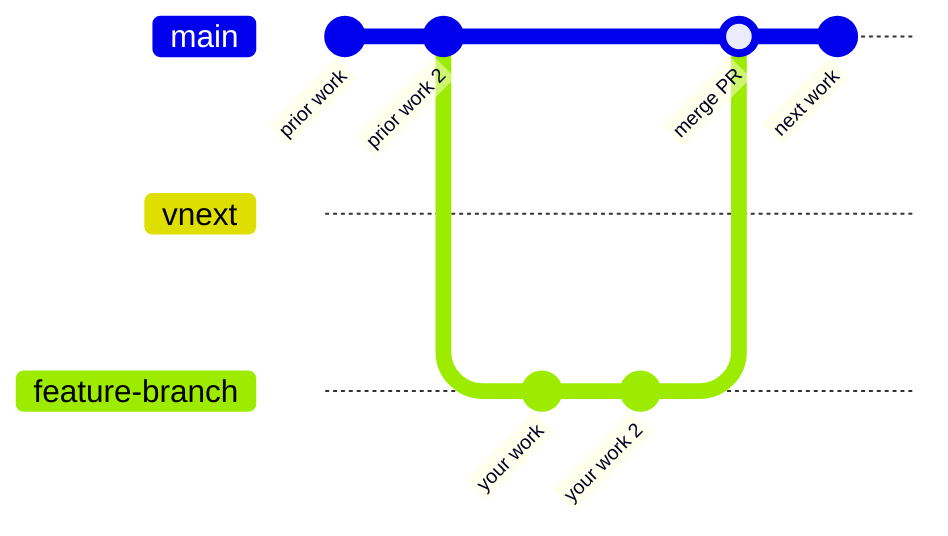
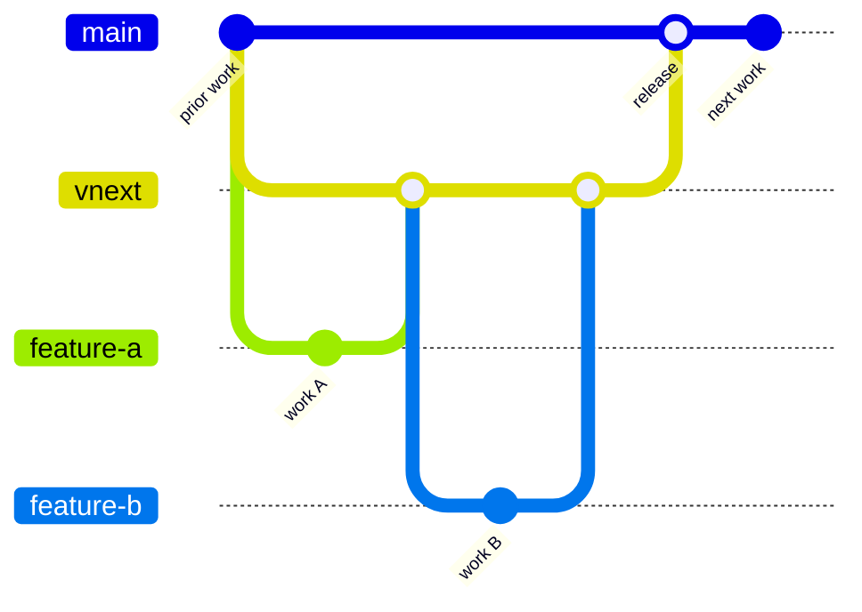

# Contributing to Overture Schema

Thank you for your interest in contributing.

## Branching Strategy

> **Work in progress.** This strategy is being rolled out incrementally. See the [DevOps tracking issue #490](https://github.com/OvertureMaps/schema/issues/490) for current status and upcoming phases.

This repository uses a two-branch model. Choose your target branch based on the nature of your change. See the [Change Classification](https://lf-overturemaps.atlassian.net/wiki/spaces/SCHEM/pages/14286874/Schema+versioning+and+stability#Change-Classification) wiki page for a detailed breakdown of what constitutes a minor vs. major change.

| Branch | Purpose |
|--------|---------|
| `main` | Default branch. Bug fixes, minor features, schema improvements. |
| `vnext` | Major or breaking changes tied to an active `vnext` milestone. |

When in doubt, target `main` and note in your PR description if you think it belongs in `vnext`.

### Normal contribution (`main`)



### Major / breaking change (`vnext`)



## Branch Protections

Both `main` and `vnext` require a PR and at least two approving reviews before merge. No direct pushes.

## CI Checks

### PR target check (advisory)

Every PR runs an advisory label-vs-target check. It **never blocks** a merge — the reviewer is the
source of truth for change classification.

| Situation | Warning |
|-----------|---------|
| PR targets `vnext`, label is not `change type - major 🚨` or `change type - minor 🤏` | Consider targeting `main` instead |
| PR targets `main`, label is `change type - major 🚨` or `change type - minor 🤏` | Consider targeting `vnext` instead |

### vnext compatibility check

Every PR targeting `main` runs a compatibility check:

1. The PR is squash-simulated onto `main` in a throwaway clone.
2. `vnext` is dry-run rebased onto the result.
3. If there is no conflict — the check passes silently.
4. If there is a conflict — the check **fails** and CI posts a comment with exact commands.

**Skipped** for `vnext`→`main` release PRs.

#### Resolving a vnext conflict

If this check flags your PR, CI will post a comment listing the conflicting files. Do **not** rebase
your branch onto `vnext` — that would pull unreleased breaking changes into `main`.

1. See exactly what `vnext` changes in the conflicting files:
   ```bash
   git fetch origin
   git diff origin/main...origin/vnext -- <conflicting files>
   ```
2. Open each conflicting file in your editor. The diff above shows what `vnext` adds or changes
   there — adjust your edits so they no longer overlap with those lines.
3. Commit the adjustment and push:
   ```bash
   git add <conflicting files>
   git commit -m "fix: resolve vnext compatibility"
   git push origin your-branch
   ```

After pushing, the check re-runs automatically.

### Post-merge vnext rebase

When any PR merges to `main`, `vnext` is automatically force-rebased onto the new `main` HEAD
using the `overture-pull-requester` GitHub App.

**Skipped** for `vnext`→`main` release merges — `vnext` is already equal to `main` at that point.

If the automatic rebase fails, a GitHub issue is opened and assigned to the author of the merged PR.

> **Accepted tradeoff — in-flight PRs targeting `vnext`:** after the automatic rebase, the base of
> any open PR that targets `vnext` will be force-updated. If you have such a PR open, run
> `git pull --rebase` (or `git fetch origin && git rebase origin/vnext`) on your branch before
> pushing again.

## Migration Notes

When Phases 0-4 are complete, this area can be removed in favor of more permanent documentation.

### [Phase 0](https://github.com/OvertureMaps/schema/issues/506), May 2026

- `main` was fast-forwarded to the former `dev` HEAD.
- All open PRs were retargeted `dev` → `main` automatically.
- `dev` and `staging` branches were deleted.
- `vnext` was created from the new `main`.

If your fork still references `dev` or `staging`, update your remotes accordingly.

### [Phase 1](https://github.com/OvertureMaps/schema/issues/507), May 2026

- Advisory PR target check added: warns when your change-type label and target branch look mismatched.
- vnext compatibility check added: every PR to `main` verifies that `vnext` can rebase cleanly on top; posts exact fix commands on conflict.
- Post-merge automatic rebase added: `vnext` is force-rebased onto `main` after every merge; if it fails, a GitHub issue is opened.

### [Phase 2](https://github.com/OvertureMaps/schema/issues/508)

- WIP / Pending

### [Phase 3](https://github.com/OvertureMaps/schema/issues/509)

- WIP / Pending

### [Phase 4](https://github.com/OvertureMaps/schema/issues/510)

- WIP / Pending
