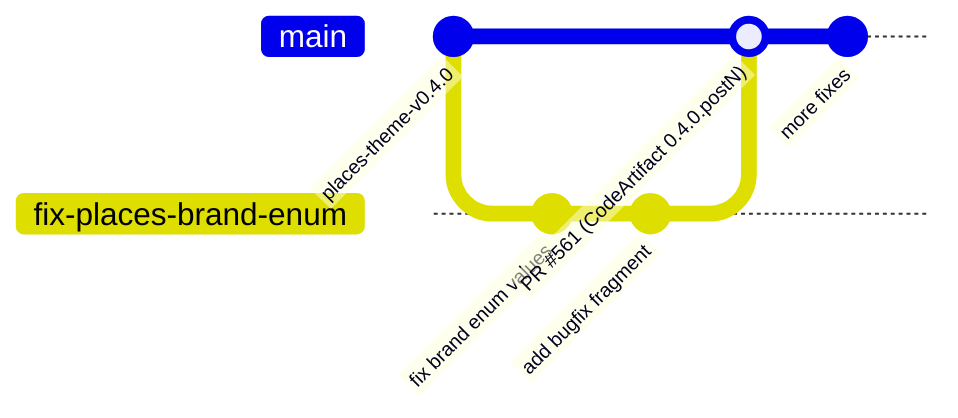
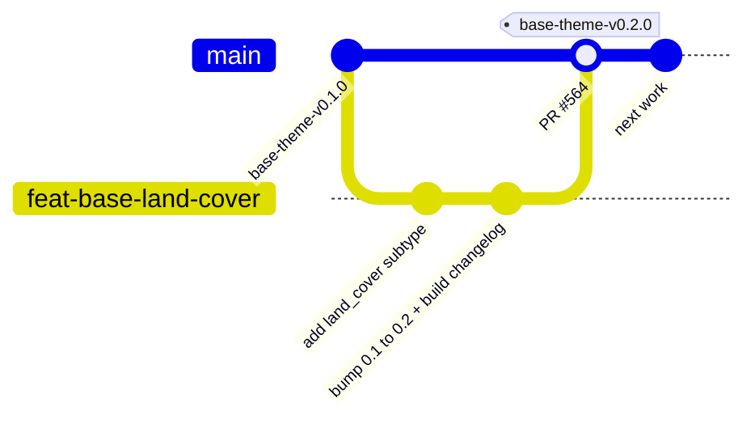
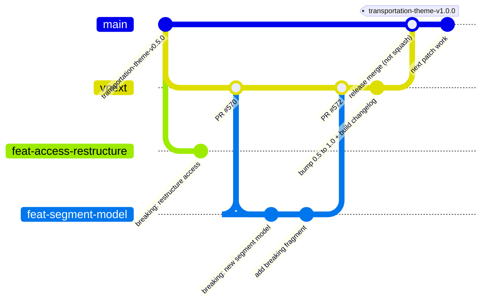

# Contributing to Overture Schema

Thank you for your interest in contributing.

## Working with the Python packages

The schema is authored as Pydantic models. [SCHEMA_GUIDE.md](SCHEMA_GUIDE.md) covers
installing and using the packages; [AUTHORING.md](AUTHORING.md) covers authoring new
schema models and the development workflow (`uv sync`, `make check`, ruff and
docformatter). [TROUBLESHOOTING.md](TROUBLESHOOTING.md) collects the errors that cost
people time.

## Where to send your change

This repository uses a two-branch model. Target the branch that matches your
change; when in doubt, target `main` and note in your PR if you think it belongs
in `vnext`. The
[Change Classification](https://lf-overturemaps.atlassian.net/wiki/spaces/SCHEM/pages/14286874/Schema+versioning+and+stability#Change-Classification)
wiki page breaks down what counts as a minor vs. major change.

| Branch | Use for |
|--------|---------|
| `main` | Default branch. Bug fixes, minor features, schema improvements. |
| `vnext` | Major or breaking changes tied to an active `vnext` milestone. |

Three common paths take a branch to a merge. Expand each for the commit-level flow.

<strong><code>main</code> &rarr; everyday change (no version bump)</strong>

Everyday fixes and schema tweaks that don't warrant an immediate release. You
do not touch the version; on merge CI publishes an interim internal build
(`<version>.postN+main.<sha>`) to CodeArtifact, where it is consumable
immediately. No GitHub Release is cut and nothing lands on public PyPI; the
change reaches public PyPI with the package's next version bump (patch, minor,
or major).

```mermaid
gitGraph
   commit id: "places-theme-v0.4.0"
   branch fix-places-brand-enum
   checkout fix-places-brand-enum
   commit id: "fix brand enum values"
   commit id: "add bugfix fragment"
   checkout main
   merge fix-places-brand-enum id: "PR #561 (CodeArtifact 0.4.0.postN)"
   commit id: "more fixes"
```

<strong><code>main</code> &rarr; patch or minor release (version bump)</strong>

A bug fix or minor feature that bumps the version in the PR and builds the
changelog. On merge, `release-trigger` cuts a published GitHub Release, which
starts the PyPI publish via Trusted Publishing; the version-bump PR review is
the approval, so nothing further gates it before reaching consumers.

```mermaid
gitGraph
   commit id: "base-theme-v0.1.0"
   branch feat-base-land-cover
   checkout feat-base-land-cover
   commit id: "add land_cover subtype"
   commit id: "bump 0.1 to 0.2 + build changelog"
   checkout main
   merge feat-base-land-cover id: "PR #564" tag: "base-theme-v0.2.0"
   commit id: "next work"
```

<strong><code>vnext</code> &rarr; major release</strong>

Breaking changes stack on `vnext` until the milestone is ready. Then `vnext`
merges into `main` as a regular merge (not a squash), which cuts a published
GitHub Release and starts the same PyPI publish as any other release.

```mermaid
gitGraph
   commit id: "transportation-theme-v0.5.0"
   branch vnext
   checkout vnext
   branch feat-access-restructure
   checkout feat-access-restructure
   commit id: "breaking: restructure access"
   commit id: "add breaking fragment"
   checkout vnext
   merge feat-access-restructure id: "PR #570"
   branch feat-segment-model
   checkout feat-segment-model
   commit id: "breaking: new segment model"
   commit id: "add breaking fragment"
   checkout vnext
   merge feat-segment-model id: "PR #572"
   commit id: "bump 0.5 to 1.0 + build changelog"
   checkout main
   merge vnext id: "release merge (not squash)" tag: "transportation-theme-v1.0.0"
   commit id: "next patch work"
```

The `bump ... + build changelog` commit edits the package version in
`pyproject.toml` and folds its `changelog.d/` fragments into `CHANGELOG.md`. On
merge to `main`, CI cuts a published GitHub Release tagged
`<package>-v<version>` with those notes. See
[docs/versioning.md](docs/versioning.md).

## Opening a PR

Two CI checks may comment on your PR:

- [vnext compatibility check](.github/workflows/vnext-compat.yaml): fails and
  posts the fix if your change clashes with unreleased `vnext` work.
- [PR advisory check](.github/workflows/pr-advisory.yaml): flags a likely
  change-type / target-branch mismatch. Advisory only; the reviewer decides.

Follow the comment each check leaves on the PR.

If you have an open PR against `vnext`, its base may be force-updated after a
merge to `main`; run `git pull --rebase` before pushing again.

## Changing a package version

- The full `<major>.<minor>.<patch>` is your call: edit it in `pyproject.toml`
  and any increase (patch included) ships a release. Patch and minor bumps
  target `main`; major bumps target `vnext`.
- Between releases, CI stamps interim internal builds as
  `<version>.postN+main.<sha>` (or `+vnext.<sha>`); never write `.postN`
  suffixes manually.
- Every package versions and releases independently. Consumers pin only
  `overture-schema`, which pulls in the theme and support packages for a coherent
  set.
- Any change to a package **requires a changelog fragment**: one sentence in
  one file under `packages/<package>/changelog.d/`, see the
  [changelog quick start](docs/versioning.md#changelog-quick-start). CI
  enforces it. Fragments are folded into `CHANGELOG.md` at release time, not
  in your PR.

Full version scheme, tag scheme, and release flow: [docs/versioning.md](docs/versioning.md).
