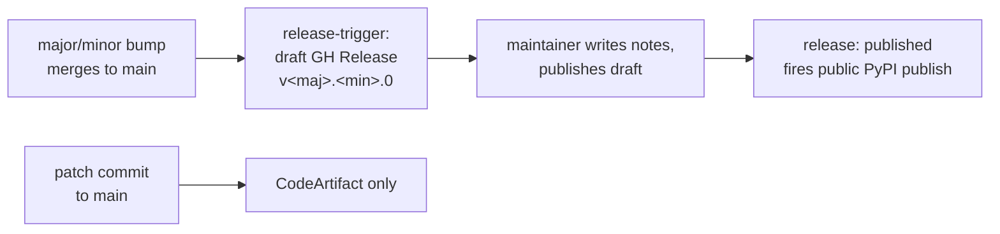

# Versioning and Releases

How package versions are computed, when they bump, and how a public release
happens. For branch mechanics and CI guardrails see
[CONTRIBUTING.md](../CONTRIBUTING.md).

## Version scheme

All packages under `packages/*` carry a static `<major>.<minor>.<patch>`
version in their `pyproject.toml` (PEP 440).

| Component | Owner | Meaning |
|-----------|-------|---------|
| `<major>.<minor>` | Human | Deliberate, reviewed decision. Edited in `pyproject.toml` via PR. |
| `<patch>` | CI | Computed at publish time by the [`compute-version`](../.github/actions/compute-version/action.yml) action. The `pyproject.toml` patch acts only as a floor (baselining). |

> [!IMPORTANT]
> The umbrella package `overture-schema` is special: only its
> `<major>.<minor>` bump triggers a public release. All other packages
> version independently but publish to CodeArtifact only, until they ride
> along an umbrella release.

## What CI does with the patch component

| Event | Version formula | Destination |
|-------|-----------------|-------------|
| Push to `vnext` | `<last-published>+dev.<run#>` | CodeArtifact (dev) |
| Push to `main`, no bump | `<major>.<minor>.<next-patch>` | CodeArtifact only |
| Push to `main` with umbrella major/minor bump | `<major>.<minor>.0` | Public PyPI (via GitHub Release, see below) |

> [!NOTE]
> Patch commits to `main` never reach public PyPI. CodeArtifact is the only
> destination for auto-versioned builds. The publish workflows themselves are
> Phase 3 ([#509](https://github.com/OvertureMaps/schema/issues/509)).

## Bump rules

### Patch

Never edit it manually (except baselining). CI computes it.

### Minor

Backward-compatible feature or schema addition. Edit `pyproject.toml` in your
PR targeting `main`.

### Major

Breaking change. Edit `pyproject.toml` in your PR targeting `vnext`; it
reaches `main` via the release merge below.

> [!TIP]
> When you bump `<major>` or `<minor>`, reset the patch component to `0`
> (e.g. `1.17.1` to `1.18.0`).

## Release process

A public PyPI release happens only through this flow:

1. A PR containing an `overture-schema` `<major>.<minor>` bump merges to
   `main`. Minor bumps merge directly; major bumps arrive via a
   `vnext` to `main` release PR (see below).
2. The [`release-trigger`](../.github/workflows/release-trigger.yaml)
   workflow detects the bump and creates a draft GitHub Release tagged
   `v<major>.<minor>.0`.
3. A maintainer writes the release notes on the draft and clicks
   "Publish release". Release notes are authored manually at release time;
   there is no fragment or auto-generation machinery.
4. The `release: published` event fires the public PyPI publish pipeline
   (Phase 3, [#509](https://github.com/OvertureMaps/schema/issues/509)),
   which publishes the release's packages. Exact package scope is defined
   by the Phase 3 publish workflows.

### vnext to main release PRs

- Opened by a maintainer when a `vnext` milestone is ready to ship.
- The `vnext compatibility check` and `post-merge vnext rebase` workflows
  skip automatically when the PR head is `vnext`.

> [!WARNING]
> Use a regular merge commit, not squash, so `vnext` history is preserved
> and the post-merge rebase can no-op.

### Guardrails

- `release-trigger` fails loudly if the target tag already exists. A
  duplicate bump landing on `main` requires human investigation before
  re-releasing.
- Non-umbrella package bumps do not create releases. If a non-core package
  needs a public release now, bump the umbrella package's minor in the same
  PR. This is a one-line change and reflects that the umbrella
  distribution's contents changed. Otherwise the package reaches public
  PyPI with the next umbrella release.
