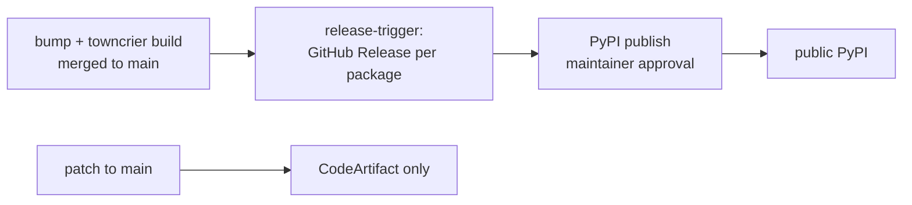

# Versioning and releases

Reference and how-to for package versions and releases. Branch mechanics and the
`vnext`/`main` workflow live in [CONTRIBUTING.md](../CONTRIBUTING.md).

## Contents

- [Reference](#reference)
  - [Version scheme](#version-scheme)
  - [Version → destination](#version--destination)
  - [Tag scheme](#tag-scheme)
  - [Guardrails](#guardrails)
- [How to](#how-to)
  - [Add a changelog fragment](#add-a-changelog-fragment)
  - [Cut a release](#cut-a-release)
- [Why](#why)

## Reference

### Version scheme

Every distributable package under `packages/*` carries its own independent
`<major>.<minor>.<patch>` ([PEP 440](https://peps.python.org/pep-0440/)) in its `pyproject.toml`.

| Component | Owner | Set by |
|-----------|-------|--------|
| `<major>.<minor>` | Human | Edited in `pyproject.toml` via a reviewed PR. |
| `<patch>` | CI | [`compute-version`](../.github/actions/compute-version/action.yml) at publish time. The `pyproject.toml` patch is only a floor. |

### Version → destination

| Event | Version | Destination |
|-------|---------|-------------|
| Push to `vnext` | `<last-published>+dev.<run#>` | CodeArtifact (dev) |
| Push to `main`, no bump | `<major>.<minor>.<next-patch>` | CodeArtifact |
| `major.minor` bump on `main` | `<major>.<minor>.0` | Public PyPI |

### Tag scheme

Each package has its own release series: tag `<package>-v<major>.<minor>.<patch>`,
title `` `<package>` <version> ``. The umbrella `overture-schema` release is
flagged **Latest**.

Historical single-series tags (`v0.4.0` … `v1.17.0`) remain valid. The
package-prefixed scheme is new so packages can version independently. This is a
deliberate, one-time discontinuity.

### Guardrails

- A changelog fragment is **required** on any change to a package, enforced by
  the `Changelog fragment verification` check.
- `release-trigger` fails if the target tag already exists, or if a version goes
  backwards.

## How to

### Add a changelog fragment

Release notes are assembled from
[towncrier](https://towncrier.readthedocs.io) fragments. Add one for every change
to a package, including patch-level fixes and internal work (use the `misc`
type), under the affected package:

```text
packages/<package>/changelog.d/<issue-or-pr>.<type>.md
```

| `<type>` | For |
|----------|-----|
| `breaking` | Backward-incompatible changes |
| `feature` | New functionality |
| `bugfix` | Bug fixes |
| `docs` | Documentation-only changes |
| `misc` | Tooling / internal changes |

The file body is the note itself, written in past tense
(e.g. `Added `provider` to the sources resource.`). Preview the rendered section:

```bash
# from the repo root
uvx towncrier build --config pyproject.toml --dir packages/<package> --draft --version <major>.<minor>.0
```

A fragment (or an already-built `CHANGELOG.md` entry) is required on any PR that
changes that package, whether or not it bumps the version.

> [!NOTE]
> The towncrier categories above are defined once in the root `pyproject.toml`.
> A package can override them by adding its own `[tool.towncrier]` block and
> building from that package directory (towncrier replaces, not merges).

### Cut a release

1. Bump `<major>.<minor>` in the package's `pyproject.toml` (reset patch to `0`),
   then run `uvx towncrier build --config pyproject.toml --dir packages/<package>`
   from the repo root to fold its fragments into `CHANGELOG.md`. Minor bumps
   target `main`; major bumps go via `vnext` and reach `main` through a release
   merge.
2. On merge to `main`, `release-trigger` publishes one GitHub Release per bumped
   package: tag `<package>-v<major>.<minor>.0`, notes from that package's
   `CHANGELOG.md`.
3. Publishing the release starts the PyPI publish, gated by a maintainer
   approval.



## Why

- **Human owns `major.minor`, CI owns `patch`.** Release intent is a reviewed
  decision; patch numbering is mechanical.
- **Independent per-package versions.** Packages evolve at their own pace.
  Consumers pin only `overture-schema`, which depends on the theme/support
  packages, giving them a coherent set without tracking each one.
- **towncrier fragments.** Notes are written in context per PR and assembled
  automatically, with no merge conflicts on a shared changelog and no
  hand-written notes at release time.
