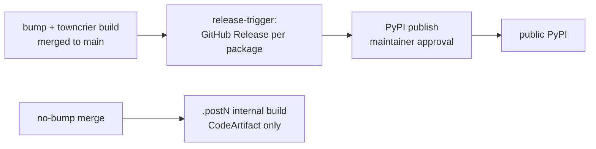

# Versioning and releases

Reference and how-to for package versions and releases. Branch mechanics and the
`vnext`/`main` workflow live in [CONTRIBUTING.md](../CONTRIBUTING.md).

## Contents

- [Reference](#reference)
  - [Version scheme](#version-scheme)
  - [Version → destination](#version--destination)
  - [Workspace dependency floors](#workspace-dependency-floors)
  - [Tag scheme](#tag-scheme)
  - [Guardrails](#guardrails)
- [How to](#how-to)
  - [Add a changelog fragment](#add-a-changelog-fragment)
  - [Cut a release](#cut-a-release)
- [Why](#why)

## Reference

### Version scheme

Every distributable package under `packages/*` carries its own independent
`<major>.<minor>.<patch>` ([PEP 440](https://peps.python.org/pep-0440/)) in its `pyproject.toml`.

| Component | Owner | Set by |
|-----------|-------|--------|
| `<major>.<minor>.<patch>` | Human | Edited in `pyproject.toml` via a reviewed PR. Any increase, patch included, is a release. |
| `.post<N>+<stream>.<sha>` | CI | [`compute-version`](../.github/actions/compute-version/action.yml) stamps interim internal builds between releases. |

### Version → destination

| Event | Version | Destination |
|-------|---------|-------------|
| Push to `main`, no bump | `<version>.postN+main.<sha>` | CodeArtifact |
| Version bump on `main` | `<version>` | GitHub Release, then public PyPI |
| Push to `vnext` | `<version>.postN+vnext.<sha>` | Blocked on a dedicated dev repository ([ops-team#299](https://github.com/OvertureMaps/ops-team/issues/299)) |

Internal builds use PEP 440 post-releases so they order after the released
`<version>`: a consumer pinning `>=1.2.3` resolves `1.2.3.post4+main.abc1234`
from CodeArtifact when present (verified with uv), while `==1.2.3` still
selects the clean release. Pin with `>=`, never `>`: PEP 440 excludes
post-releases from exclusive ordered comparisons, so `>1.2.3` matches no
internal build. `N` is a per-version sequence: the first internal build of a
version is `.post0` (identical contents to the release), incrementing from
the highest `.postN` already published. The
`+main`/`+vnext` local label names the build stream but does not participate
in version ordering, so the two streams must never share a repository: in a
shared repo, a `>=` consumer can resolve a `vnext` build (breaking changes)
over the `main` one. `vnext` builds publish only once a separate dev
repository exists. Local labels are rejected by public PyPI, which keeps
internal builds off the public index by construction.

### Workspace dependency floors

Intra-repo dependencies follow uv's
[dual declaration](https://docs.astral.sh/uv/concepts/projects/dependencies/#workspace-member)
pattern: an explicit specifier in `project.dependencies` (e.g.
`overture-schema-common>=0.1.1`) alongside a `[tool.uv.sources]` workspace
entry. Development resolves against the workspace source; built wheels carry
the specifier.

Floors are maintained by hand. Raise a floor only when your package needs
something from the newer dependency version; floors carry released versions
only, never a `.postN` suffix. Major bumps are the exception, they must
cascade (see [Guardrails](#guardrails)).

### Tag scheme

Each package has its own release series: tag `<package>-v<major>.<minor>.<patch>`,
title `` `<package>` <version> ``. The umbrella `overture-schema` release is
flagged **Latest**.

Historical single-series tags (`v0.4.0` … `v1.17.0`) remain valid. The
package-prefixed scheme is new so packages can version independently. This is a
deliberate, one-time discontinuity.

### Guardrails

- A changelog fragment is **required** on any change to a package, enforced by
  the `Changelog fragment verification` check.
- `release-trigger` fails if the target tag already exists, or if a version goes
  backwards.
- Major bumps cascade: a package whose workspace dependency takes a major bump
  must take one itself, and its floor on that dependency must be raised, since
  the old floor would admit a breaking version. Enforced at PR time by the
  version check and again by `release-trigger`.

## How to

### Add a changelog fragment

Release notes are assembled from
[towncrier](https://towncrier.readthedocs.io) fragments. Add one for every change
to a package, including patch-level fixes and internal work (use the `misc`
type), under the affected package:

```text
packages/<package>/changelog.d/<issue-or-pr>.<type>.md
```

| `<type>` | For |
|----------|-----|
| `breaking` | Backward-incompatible changes |
| `feature` | New functionality |
| `bugfix` | Bug fixes |
| `docs` | Documentation-only changes |
| `misc` | Tooling / internal changes |

The file body is the note itself, written in past tense
(e.g. `Added `provider` to the sources resource.`). Preview the rendered section:

```bash
# from the repo root
uvx towncrier build --config pyproject.toml --dir packages/<package> --draft --version <version>
```

A fragment (or an already-built `CHANGELOG.md` entry) is required on any PR that
changes that package, whether or not it bumps the version.

> [!NOTE]
> The towncrier categories above are defined once in the root `pyproject.toml`.
> A package can override them by adding its own `[tool.towncrier]` block and
> building from that package directory (towncrier replaces, not merges).

### Cut a release

1. Bump the version in the package's `pyproject.toml`,
   then run `uvx towncrier build --config pyproject.toml --dir packages/<package>`
   from the repo root to fold its fragments into `CHANGELOG.md`. Patch and minor
   bumps target `main`; major bumps go via `vnext` and reach `main` through a
   release merge.
2. On merge to `main`, `release-trigger` publishes one GitHub Release per bumped
   package: tag `<package>-v<version>`, notes from that package's
   `CHANGELOG.md`.
3. Publishing the release starts the PyPI publish, gated by a maintainer
   approval.


```mermaid
flowchart LR
    A[bump + towncrier build<br/>merged to main] --> B[release-trigger:<br/>GitHub Release per package]
    B --> C[PyPI publish<br/>maintainer approval] --> D[public PyPI]
    E[no-bump merge] --> F[.postN internal build<br/>CodeArtifact only]
```

## Why

- **Humans own the full version.** Every released `<major>.<minor>.<patch>` is
  a reviewed decision, so patch-level bug fixes can ship to PyPI without
  masquerading as minor releases. CI versions only the interim `.postN`
  builds between releases.
- **Post-releases for internal builds.** `.postN` orders after the released
  version, so `>=<version>` specifiers pick up the freshest internal build
  from CodeArtifact; the `+main`/`+vnext` label separates the two streams and
  keeps the builds off public PyPI.
- **Independent per-package versions.** Packages evolve at their own pace.
  Consumers pin only `overture-schema`, which depends on the theme/support
  packages, giving them a coherent set without tracking each one.
- **towncrier fragments.** Notes are written in context per PR and assembled
  automatically, with no merge conflicts on a shared changelog and no
  hand-written notes at release time.
