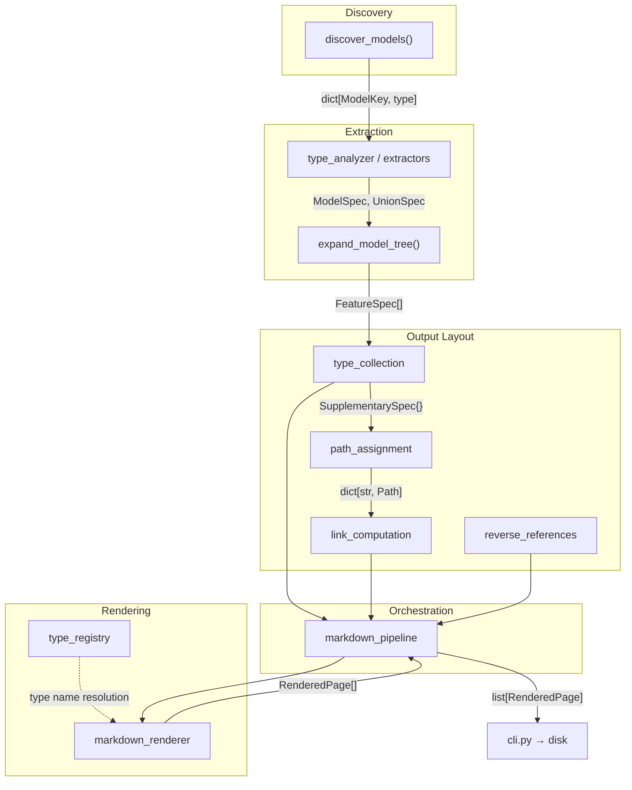

# Code Generator Design

Code generator that produces documentation and code from Overture Maps Pydantic schema
definitions.

## Problem

Overture Maps schema definitions live in Pydantic models across theme packages. Each
model carries type annotations, field constraints, docstrings, and relationships
(inheritance, composition, discriminated unions). Generating documentation or code from
these models requires introspecting all of that structure and rendering it into output
formats.

Pydantic's internal representation is JSON-schema-oriented and discards the vocabulary
the code generator needs to preserve. `model_json_schema()` flattens `FeatureVersion` (a
NewType wrapping `int32` wrapping `Annotated[int, Field(ge=0, le=2^31-1)]`) to `{"type":
"integer", "minimum": 0}` -- the NewType names `FeatureVersion` and `int32` are gone,
custom constraint classes (`GeometryTypeConstraint`, `UniqueItemsConstraint`) are gone,
Python class references are gone, and constraint provenance (which NewType contributed
which bound) is gone. `FieldInfo.annotation` gives the raw annotation, but Pydantic does
not unwrap NewType chains or track multi-depth constraint provenance.

The schema's domain language -- custom primitives (`int32`, `float64`), semantic
NewTypes (`FeatureVersion`, `Sources`), and custom constraint classes -- needs to
survive extraction intact. A single field annotation like `NewType("Foo",
Annotated[list[SomeModel] | None, Field(ge=0)])` encodes optionality, collection type,
element type, constraints, and semantic naming in nested Python typing constructs. Type
definitions regularly nest `Annotated` inside `NewType` inside `Annotated` --
`FeatureVersion = NewType("FeatureVersion", int32)` where `int32 = NewType("int32",
Annotated[int, Field(ge=...)])` -- and constraints at each depth need to be tagged with
the NewType that contributed them.

The code generator solves this by extracting type information once into a flat,
navigable representation (`TypeInfo`), then passing that to renderers that produce
output without touching Python's type system.

## Inputs and Outputs

**Inputs**: Pydantic `BaseModel` subclasses discovered via `overture.models` entry
points, plus example data from theme `pyproject.toml` files. Examples serve two
purposes: rendered examples in documentation pages, and a starting point for generating
tests that verify behavior of generated code.

**Current Outputs**: Markdown documentation pages with field tables, cross-page links,
constraint descriptions, and examples.

**Planned outputs**: Arrow schemas, PySpark expressions.

## Architecture

Four layers with strict downward imports -- no layer references the one above it:

```text
Rendering            Output formatting, all presentation decisions
    ^
Output Layout        What to generate, where it goes, how outputs link
    ^
Extraction           TypeInfo, FieldSpec, ModelSpec, EnumSpec, ...
    ^
Discovery            discover_models() from overture-schema-core
```

`markdown_pipeline.py` orchestrates the pipeline without I/O: it expands feature trees,
collects supplementary types, builds placement registries, computes reverse references,
and calls renderers -- returning `RenderedPage` objects. The CLI (`cli.py`) is a thin
Click wrapper that calls `generate_markdown_pages()` and writes files to disk.



## Extraction

### `analyze_type` -- iterative type unwrapping

`analyze_type(annotation)` is a single iterative function that peels type annotation
layers in a fixed order, accumulating information into an `_UnwrapState`:

1. **NewType**: Records the outermost name (user-facing semantic identity, e.g.
   `FeatureVersion`) and updates the "current" name (used for constraint provenance and
   as `base_type` at terminal)
2. **Annotated**: Collects constraints from metadata, each tagged with whichever NewType
   was most recently entered. Extracts `Field.description` when present
3. **Union**: Filters out `None` (marks optional), `Sentinel`, and `Literal` sentinel
   arms. If multiple concrete `BaseModel` arms remain, classifies as `UNION`; otherwise
   continues with the single remaining arm
4. **list / dict**: Increments `list_depth` for each `list[...]` layer, sets dict flags,
   continues into element types
5. **Terminal**: Classifies as `PRIMITIVE`, `LITERAL`, `ENUM`, `MODEL`, or `UNION`

The result is `TypeInfo` -- a flat dataclass that fully describes the unwrapped type:
classification (`TypeKind`), optional/dict flags, `list_depth` (count of `list[...]`
layers), `newtype_outer_list_depth` (list layers outside the outermost NewType boundary),
accumulated constraints with provenance, NewType names, source type, literal values, and
(for UNION kind) the tuple of concrete `BaseModel` member types. Dict types carry
recursively analyzed `TypeInfo` for their key and value types.

Multi-depth `Annotated` layers (common in practice, since NewTypes wrap `Annotated`
types that wrap further NewTypes) are handled naturally by the loop -- each iteration
processes the next wrapper. Constraints from each `Annotated` layer are tagged with the
NewType active at that depth.

### Extractors by domain

Extraction is split by entity kind:

- `model_extraction.py`: Pydantic model -> `ModelSpec` (fields in MRO-aware
  documentation order, alias-resolved names, model-level constraints)
- `enum_extraction.py`: Enum class -> `EnumSpec`
- `newtype_extraction.py`: NewType -> `NewTypeSpec`
- `union_extraction.py`: Discriminated union alias -> `UnionSpec`
- `primitive_extraction.py`: Numeric primitives -> `PrimitiveSpec`

Each calls `analyze_type()` for field types. Tree expansion (`expand_model_tree()`)
walks MODEL-kind fields to populate nested model references, with a shared cache and
cycle detection (`starts_cycle=True`).

### Unions and the FeatureSpec protocol

Discriminated unions (e.g. `Segment = Annotated[Union[RoadSegment, ...],
Discriminator(...)]`) are type aliases, not classes. `UnionSpec` captures the union
structure: member types, discriminator field and value mapping, and a merged field list.
Fields shared across all variants appear once; fields present in some variants are
wrapped in `AnnotatedField` with `variant_sources` indicating which members contribute
them. The common base class is identified so shared fields can be deduplicated.

`FeatureSpec` is a `Protocol` satisfied by both `ModelSpec` and `UnionSpec`. Code that
operates on "any top-level feature" -- tree expansion, supplementary type collection,
rendering dispatch -- uses `FeatureSpec` rather than a concrete type, so union and model
features flow through the same pipeline.

### Constraints

Field-level constraints come from `Annotated` metadata -- `Ge`, `Le`, `Interval`, custom
constraint classes. Each is tagged with the NewType that contributed it via
`ConstraintSource`.

Model-level constraints come from decorators (`@require_any_of`, `@require_if`,
`@forbid_if`) and are extracted via `ModelConstraint.get_model_constraints()`.

## Output Layout

Determines the full set of artifacts to generate, where each lives on disk, and how they
reference each other.

### Supplementary type collection

`collect_all_supplementary_types()` walks the expanded field trees of all feature specs,
extracting enums, semantic NewTypes, and sub-models that need their own output. Returns
`dict[str, SupplementarySpec]`.

### Module-mirrored output paths

Output paths derive from the source Python module path relative to a computed schema
root (`compute_schema_root()` finds the longest common prefix of all entry point module
paths). `compute_output_dir()` maps a Python module to an output directory. Feature
models land in their module-derived directory. Supplementary types land at their own
module-derived path, with a `types/` segment inserted when they fall under a feature
directory.

### Link computation

`LinkContext` carries the current output's path and the full type-to-path registry. When
a renderer formats a type reference, it looks up the target in the registry and computes
a relative path. Links exist only for types with registry entries, avoiding broken
references to ungenerated outputs.

### Reverse references

`compute_reverse_references()` walks feature specs to build `dict[type_name,
list[UsedByEntry]]` for "Used By" sections.

## Rendering

Renderers consume specs and own all presentation decisions -- formatting, casing, link
syntax. Extraction and the type registry carry no presentation logic.

### Type registry

`type_registry.py` maps type names to per-target string representations via
`TypeMapping`. `format_type_string()` wraps the resolved name with list/optional
qualifiers. `is_semantic_newtype()` distinguishes NewTypes that deserve their own
identity (like `FeatureVersion` wrapping `int32`) from pass-through aliases to
registered primitives.

### Markdown renderer

Jinja2 templates for feature, enum, NewType, primitives, and geometry pages.
`render_feature()` expands MODEL-kind fields inline with dot-notation (e.g.,
`sources[].dataset`), stopping at cycle boundaries. `format_type()` in
`markdown_type_format.py` converts `TypeInfo` into link-aware display strings using
`LinkContext`.

### Constraint prose

`field_constraint_description.py` and `model_constraint_description.py` convert
constraint objects into human-readable descriptions. Field constraints produce inline
text. Model constraints produce section-level descriptions and per-field notes, with
consolidation for related conditional constraints (`require_if` / `forbid_if` grouped by
trigger).

### Example loader

Loads example data from theme `pyproject.toml` files, validates against Pydantic models,
and flattens to dot-notation rows for display in feature pages. Also provides a starting
point for generated test data.

`collect_dict_paths` walks the `FieldSpec` tree to identify dict-typed fields (like
`tags: dict[str, str]`), returning their dot-paths as a `frozenset`. `flatten_example`
checks this set before recursing into dicts -- paths in the set are kept as leaf values
rather than being split into dot-notation rows. The pipeline computes `dict_paths` from
`spec.fields` and threads it through `load_examples`.

## Extension Points

**Adding a new output target** (Arrow schemas next, PySpark expressions after): Add a
column to `TypeMapping` in `type_registry.py` for type-name resolution. Write a new
renderer module that consumes specs and the type registry. The extraction layer and
output layout are target-independent.

**Adding a new type kind**: Add a variant to `TypeKind` in `type_analyzer.py`. Handle it
in the terminal classification of `analyze_type()`. Add an extraction function and spec
dataclass if needed. Update renderers to handle the new kind.

**Adding a new constraint type**: The iterative unwrapper collects it automatically (any
`Annotated` metadata becomes a `ConstraintSource`). Add a case to
`describe_field_constraint()` for the prose representation.
