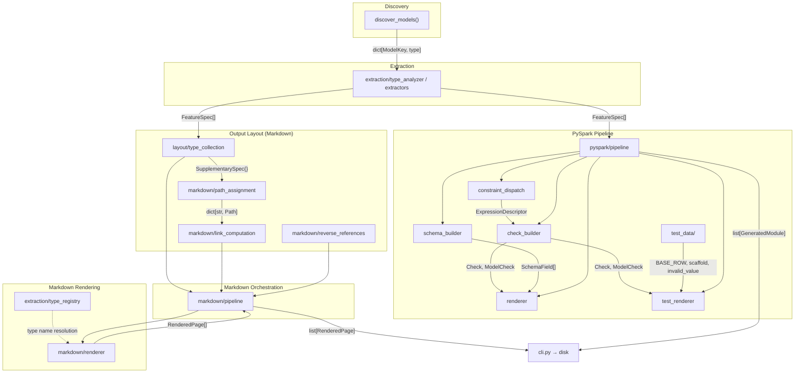

# Code Generator Design

Code generator that produces documentation and code from Overture Maps Pydantic schema
definitions.

## Problem

Overture Maps schema definitions live in Pydantic models across theme packages. Each
model carries type annotations, field constraints, docstrings, and relationships
(inheritance, composition, discriminated unions). Generating documentation or code from
these models requires introspecting all of that structure and rendering it into output
formats.

Pydantic's internal representation is JSON-schema-oriented and discards the vocabulary
the code generator needs to preserve. `model_json_schema()` flattens `FeatureVersion` (a
NewType wrapping `int32` wrapping `Annotated[int, Field(ge=0, le=2^31-1)]`) to `{"type":
"integer", "minimum": 0}` -- the NewType names `FeatureVersion` and `int32` are gone,
custom constraint classes (`GeometryTypeConstraint`, `UniqueItemsConstraint`) are gone,
Python class references are gone, and constraint provenance (which NewType contributed
which bound) is gone. `FieldInfo.annotation` gives the raw annotation, but Pydantic does
not unwrap NewType chains or track multi-depth constraint provenance.

The schema's domain language -- custom primitives (`int32`, `float64`), semantic
NewTypes (`FeatureVersion`, `Sources`), and custom constraint classes -- needs to
survive extraction intact. A single field annotation like `NewType("Foo",
Annotated[list[SomeModel] | None, Field(ge=0)])` encodes optionality, collection type,
element type, constraints, and semantic naming in nested Python typing constructs. Type
definitions regularly nest `Annotated` inside `NewType` inside `Annotated` --
`FeatureVersion = NewType("FeatureVersion", int32)` where `int32 = NewType("int32",
Annotated[int, Field(ge=...)])` -- and constraints at each depth need to be tagged with
the NewType that contributed them.

The code generator solves this by extracting type information once into a tree-shaped
`FieldShape` IR, then passing that to renderers that produce output without touching
Python's type system.

## Inputs and Outputs

**Inputs**: Pydantic `BaseModel` subclasses discovered via `overture.models` entry
points, plus example data from theme `pyproject.toml` files. Examples serve two
purposes: rendered examples in documentation pages, and a starting point for generating
tests that verify behavior of generated code.

**Outputs**:

- Markdown documentation pages with field tables, cross-page links, constraint
  descriptions, and examples.
- PySpark validation modules: per-feature expression builders, StructType schemas,
  a feature registry, and generated conformance test modules.

## Architecture

Four layers with strict downward imports -- no layer references the one above it:

```text
Rendering            Output formatting, all presentation decisions
    ^
Output Layout        What to generate, where it goes, how outputs link
    ^
Extraction           FieldShape, FieldSpec, ModelSpec, EnumSpec, ...
    ^
Discovery            discover_models() from overture-schema-common
```

Each output format has its own pipeline module that orchestrates without I/O:

- `markdown/pipeline.py` expands feature trees, collects supplementary types, builds
  placement registries, computes reverse references, and calls renderers -- returning
  `RenderedPage` objects.
- `pyspark/pipeline.py` expands feature trees, builds checks and schemas, renders
  expression modules and test modules -- returning `GeneratedModule` objects.

The CLI (`cli.py`) is a thin Click wrapper that dispatches to the appropriate pipeline
and writes files to disk.



## Extraction

### `analyze_type` -- recursive type unwrapping

`analyze_type(annotation)` recurses through a Python type annotation, peeling one layer
per call frame via the internal `_unwrap` function:

1. **NewType**: Constructs `_NewTypeCtx` with the NewType's name, recurses into
   `__supertype__`, then wraps the result in `NewTypeShape`. `_erase_inner_newtypes`
   strips every inner `NewTypeShape` reached through `ArrayOf` layers, so each spine
   keeps only its outermost `NewTypeShape` (inner NewType names survive on the
   terminal `Primitive.base_type`).
2. **Annotated**: Collects constraints from metadata as `ConstraintSource` objects,
   each tagged with the active `_NewTypeCtx`. Extracts `Field.description` when present.
   Recurses into the inner annotation, then attaches constraints to the result via
   `attach_constraints`, which prepends them to the outermost structural layer.
3. **Union**: Delegates to `_peel_union`, which filters `None` (marks optional),
   `Sentinel`, and `Literal` sentinel arms. Multiple concrete `BaseModel` arms invoke
   `union_resolver`; a single arm continues with `_unwrap`.
4. **list / dict**: `list[X]` recurses into `X` and wraps in `ArrayOf`. Nested lists
   produce nested `ArrayOf` instances -- no numeric depth counter. `dict[K, V]` recurses
   for key and value independently and returns `MapOf`.
5. **Terminal**: Classifies as `Primitive`, `LiteralScalar`, `AnyScalar`, `ModelRef`,
   or `UnionRef`.

The result is `tuple[FieldShape, bool, str | None]` -- the structural shape describing
the type as a nested tree, whether the field accepts `None`, and the first
`FieldInfo.description` found during unwrapping. `FieldShape` is a discriminated union
of eight variants (`Primitive`, `LiteralScalar`, `AnyScalar`, `ModelRef`, `UnionRef`,
`ArrayOf`, `MapOf`, `NewTypeShape`) nested to describe arbitrary collection and NewType
wrapping.

Constraints from each `Annotated` layer attach to the shape layer they annotate --
`attach_constraints` walks past any `NewTypeShape` wrappers to prepend constraints on
the first `ArrayOf`, `MapOf`, or scalar node. This means array-level and element-level
constraints land on structurally distinct nodes without any numeric bookkeeping.

### Extractors by domain

Extraction is split by entity kind:

- `extraction/model_extraction.py`: Pydantic model -> `ModelSpec` (fields in MRO-aware
  documentation order, alias-resolved names, model-level constraints)
- `extraction/enum_extraction.py`: Enum class -> `EnumSpec`
- `extraction/newtype_extraction.py`: NewType -> `NewTypeSpec`
- `extraction/union_extraction.py`: Discriminated union alias -> `UnionSpec`
- `extraction/numeric_extraction.py`: Numeric types -> `NumericSpec`
- `extraction/pydantic_extraction.py`: Pydantic built-in type -> `PydanticTypeSpec`

Each calls `analyze_type()` for field types. `extract_model` recurses into sub-models
and sub-unions during extraction, building `ModelRef`/`UnionRef` terminals with their
specs resolved. A shared cache and cycle detection (`starts_cycle=True`) prevent
infinite recursion and duplicate extraction.

### Unions and FeatureSpec

Discriminated unions (e.g. `Segment = Annotated[Union[RoadSegment, ...],
Discriminator(...)]`) are type aliases, not classes. `UnionSpec` captures the union
structure: member types, discriminator field and value mapping, and a merged field list.
Fields shared across all variants appear once; fields present in some variants are
wrapped in `AnnotatedField` with `variant_sources` indicating which members contribute
them. The common base class is identified so shared fields can be deduplicated.

`FeatureSpec` is a type alias `ModelSpec | UnionSpec`. Code that operates on "any
top-level feature" -- supplementary type collection, rendering dispatch -- uses
`FeatureSpec` so union and model features flow through the same pipeline. Consumers
narrow with `isinstance` when arm-specific attributes are needed.

### Constraints

Field-level constraints come from `Annotated` metadata -- `Ge`, `Le`, `Interval`, custom
constraint classes. Each is tagged with the NewType that contributed it via
`ConstraintSource`.

Model-level constraints come from decorators (`@require_any_of`, `@require_if`,
`@forbid_if`) and are extracted via `ModelConstraint.get_model_constraints()`.

## Output Layout

Determines the full set of artifacts to generate, where each lives on disk, and how they
reference each other.

### Supplementary type collection

`collect_all_supplementary_types()` walks the field trees of all feature specs to extract
the supplementary types that need their own output: enums, semantic NewTypes, sub-models,
and Pydantic built-in types (`HttpUrl`, `EmailStr`). Returns `dict[TypeIdentity,
SupplementarySpec]`, where `SupplementarySpec = EnumSpec | NewTypeSpec | ModelSpec |
PydanticTypeSpec`. `TypeIdentity` pairs a unique Python object with its display name so
registry lookups remain stable when two distinct types share a name.

### Module-mirrored output paths

Output paths derive from the source Python module path relative to a computed schema
root (`compute_schema_root()` finds the longest common prefix of all entry point module
paths). `compute_output_dir()` maps a Python module to an output directory. Feature
models land in their module-derived directory. Supplementary types land at their own
module-derived path, with a `types/` segment inserted when they fall under a feature
directory.

### Link computation

`LinkContext` carries the current output's path and the full `dict[TypeIdentity,
PurePosixPath]` registry. When a renderer formats a type reference, it looks up the
target by `TypeIdentity` and computes a relative path. Links exist only for types with
registry entries, avoiding broken references to ungenerated outputs.

### Reverse references

`compute_reverse_references()` walks feature specs to build `dict[TypeIdentity,
list[UsedByEntry]]` for "Used By" sections.

## Rendering

Renderers consume specs and own all presentation decisions -- formatting, casing, link
syntax. Extraction and the type registry carry no presentation logic.

### Type registry

`extraction/type_registry.py` maps type names to per-target string representations via
`TypeMapping`. `resolve_type_name()` looks up the registry and returns the display
string for a given target. `is_semantic_newtype()` distinguishes NewTypes that deserve
their own identity (like `FeatureVersion` wrapping `int32`) from pass-through aliases
to registered primitives.

### Markdown renderer

Jinja2 templates for feature, enum, NewType, primitives, and geometry pages.
`render_feature()` walks each field's `FieldShape` tree and expands `ModelRef`
terminals inline with dot-notation (e.g., `sources[].dataset`), stopping at
`ModelRef.starts_cycle`. `format_type()` in `markdown/type_format.py` converts a
`FieldShape` into link-aware display strings using `LinkContext`.

### Constraint prose

`extraction/field_constraints.py` and `extraction/model_constraints.py` convert
constraint objects into human-readable descriptions. Field constraints produce inline
text. Model constraints produce section-level descriptions and per-field notes, with
consolidation for related conditional constraints (`require_if` / `forbid_if` grouped by
trigger).

### Example loader

Loads example data from theme `pyproject.toml` files, validates against Pydantic models,
and flattens to dot-notation rows for display in feature pages. Also provides a starting
point for generated test data.

`validate_example` returns a Pydantic model instance. `flatten_model_instance` walks the
instance recursively using `isinstance(value, BaseModel)` to distinguish model fields
(recurse with dot notation) from dict fields (keep as leaf values). This eliminates the
need for external schema information -- the model instance itself encodes the type
structure. `augment_missing_fields` appends `(name, None)` entries for union cross-arm
fields absent from the concrete variant instance.

## PySpark Pipeline

The PySpark codegen transforms extracted `FeatureSpec` trees into validation expression
modules and generated conformance test modules. `pyspark/pipeline.py` exposes
`generate_pyspark_module` (single spec) and `generate_pyspark_modules` (all specs).

### Constraint Dispatch

`pyspark/constraint_dispatch.py` maps constraint objects to expression descriptors.
Four dispatch mechanisms:

1. **`dispatch_constraint`** -- field constraints (bounds, min/max length, pattern,
   stripped, geometry type, unique items, JSON pointer). Returns `ExpressionDescriptor`
   with function name, args, kwargs. Returns None for skipped constraints (Reference,
   Strict).

2. **`dispatch_newtype`** -- NewType-level overrides: `LinearlyReferencedRange` ->
   three range checks. `CountryCodeAlpha2` and `RegionCode` decompose normally
   via their `PatternConstraint` subclasses and return None here.

3. **`dispatch_base_type`** -- base-type overrides for types with no `Annotated`
   constraints: `HttpUrl` -> `check_url_format` + `check_url_length`,
   `EmailStr` -> `check_email`, `BBox` -> `check_bbox_completeness` +
   `check_bbox_lat_ordering` + `check_bbox_lat_range`.

4. **`dispatch_model_constraint`** -- model constraints: `RequireAnyOfConstraint`,
   `RadioGroupConstraint`, `RequireIfConstraint`, `ForbidIfConstraint`,
   `MinFieldsSetConstraint`. Returns `ModelConstraintDescriptor`. Returns None for
   `NoExtraFieldsConstraint`.

### Check Builder

`pyspark/check_builder.py` walks `FieldSpec` trees to produce `Check` and `ModelCheck`
IR. Resolves the mapping from nested field paths to PySpark array iteration patterns,
producing a `FieldPath` (`ScalarPath` or `ArrayPath`) on each `Check`:

- **Scalar field** -- `ScalarPath`; renders as `F.col("field")`
- **Top-level array** -- `ArrayPath` with one `ArraySegment`; renders as
  `array_check("field", lambda el: ...)`
- **Field inside an array element** -- `ArrayPath` with struct navigation after the
  array segment; renders as `array_check("array_col", lambda el: el["field"])`
- **Nested array inside an array** -- `ArrayPath` with multiple `ArraySegment`s;
  renders as `nested_array_check("outer", lambda el: array_check(el["inner"], ...))`
- **Multiple nesting levels** -- chained `nested_array_check` with struct segments
  navigating between array iterations

Union handling: variant-specific fields are annotated with `ColumnGuard` or
`ElementGuard` discriminator gates. `Check.guards` is AND-composed at render time.
Nested unions (a union field within a union) produce a `ColumnGuard` and an
`ElementGuard` in sequence on the same check.

`COLUMN_LEVEL_FUNCTIONS` (frozenset) selects checks that split into a
separate `Check`; `_COLUMN_LEVEL_SUFFIXES` (dict) supplies the label
suffix for each: `check_required` (no suffix), `check_array_min_length`
(`_min_length`), `check_array_max_length` (`_max_length`),
`check_struct_unique` (`_unique`).

### Schema Builder

`pyspark/schema_builder.py` converts `FieldSpec` trees to `SchemaField` lists for
StructType source generation. Maps types to Spark type expressions via the type registry.
`SHARED_TYPE_REFS` reserves a few base-type names for `_schema_structs.py` constants
when the codegen cannot walk the type -- currently just `BBox` -> `BBOX_STRUCT` (BBox
is a plain class, not a Pydantic `BaseModel`). Pydantic models are inlined into the
StructType expression. Union fields are deduplicated by name with type widening (the
wider Spark numeric type wins).

### Renderer

`pyspark/renderer.py` emits per-feature Python modules containing:

- Private `_fieldname_check()` functions returning `Check(field=, name=, expr=, shape=, root_field=)`
- A public `feature_checks() -> list[Check]` function calling all of them
- A per-feature `FEATURENAME_SCHEMA` StructType constant (e.g. `ADDRESS_SCHEMA`, `SEGMENT_SCHEMA`)
- An `ENTRY_POINT` string, a `PARTITIONS` dict describing the feature's Hive partition
  layout (empty when not partitioned), and a `FEATURE_VALIDATION` constant pairing the
  schema and checks

The registry is not generated. `_registry.py` lives hand-written in the
`overture-schema-pyspark` package and walks the `expressions.generated` namespace at
import time, collecting every module that exposes `ENTRY_POINT` and `FEATURE_VALIDATION`
into a `dict[str, FeatureValidation]`. Modules that also expose `PARTITIONS` populate a
parallel partition map keyed by entry point.

Expression rendering handles scalar expressions, array_check/nested_array_check chains,
variant gating (`F.when(discriminator.isin(...))`), nullable parent gating
(`F.when(gate.isNotNull(), ...)`), and nested lambda variable naming for deep nesting.
Output is formatted with ruff.

### Test Renderer

`pyspark/test_renderer.py` emits per-feature pytest modules containing:

- `BASE_ROW_SPARSE` / `BASE_ROW_POPULATED` -- valid synthetic rows
- `SCENARIOS: list[Scenario]` -- generated test cases, each carrying a
  `mutate` callable that produces an invalid row from a merged base
- Fixtures: `checks`, `sparse_results`, `populated_results`
- Tests: `test_baseline_sparse`, `test_baseline_populated`,
  `test_scenario_sparse`, `test_scenario_populated` (parametrized).
  Schema coverage runs inside `run_validation_pipeline` via
  `assert_schema_covers_checks`, not in a separate test.

Union specs with multiple discriminator arms produce one test module per arm.

### Test Data Generator

`pyspark/test_data/` is a subpackage with three modules:

- `base_row.py` -- `generate_base_row` / `generate_populated_row` produce sparse
  (required only) and fully populated valid rows from a `FeatureSpec`. Consults field
  constraints to produce constraint-satisfying values (country codes, geometry WKT,
  bounds-respecting numbers). `generate_arm_rows` / `generate_populated_arm_rows`
  produce one row per discriminator arm for union specs.
- `scaffold.py` -- `generate_scaffold` / `generate_model_scaffold` build sparse dicts
  that provide nested structure (optional structs, arrays) needed for test scenarios.
- `invalid_value.py` -- `invalid_value` produces a concrete value that violates each
  check function.

### Known Semantic Gaps

PySpark validation diverges from Pydantic validation in two documented areas:

- `UniqueItemsConstraint` uses Spark's `array_distinct`, which compares whole
  elements with structural equality (struct- and nested-array-aware) on the raw
  stored values. Pydantic compares normalized Python objects -- e.g.,
  `list[HttpUrl]` is compared after URL normalization (trailing slash, lowercased
  scheme/host) -- so it catches duplicates that differ only in normalization. The
  PySpark check catches exact duplicates only.

- `require_any_of` checks `isNotNull` as a proxy for Pydantic's `model_fields_set`.
  Parquet has no equivalent of "explicitly provided"; `isNotNull` is stricter (it
  rejects fields explicitly set to null).

## Extension Points

**Adding a new output target**: Add a column to `TypeMapping` in
`extraction/type_registry.py` for type-name resolution. Write a pipeline module that
consumes `FeatureSpec` trees and a renderer that produces output. The extraction layer is
target-independent. Register the format in `cli.py`.

**Adding a new type kind**: Add a variant to `FieldShape` in `extraction/field.py`.
Handle it in the terminal classification of `analyze_type()`. Add an extraction function
and spec dataclass if needed. Update `extraction/field_walk.py` traversal helpers and
all renderers to handle the new variant.

**Adding a new constraint type**: `_unwrap` collects it automatically (any `Annotated`
metadata becomes a `ConstraintSource`). Add a case to
`describe_field_constraint()` for prose and to `dispatch_constraint()` for PySpark
expression mapping.

**Adding a new PySpark check function**: Add a case in `dispatch_constraint`,
`dispatch_newtype`, or `dispatch_base_type` in `constraint_dispatch.py`. Add an
`invalid_value` case in `test_data/invalid_value.py` for test generation. The check builder and
renderer handle the new descriptor automatically.
